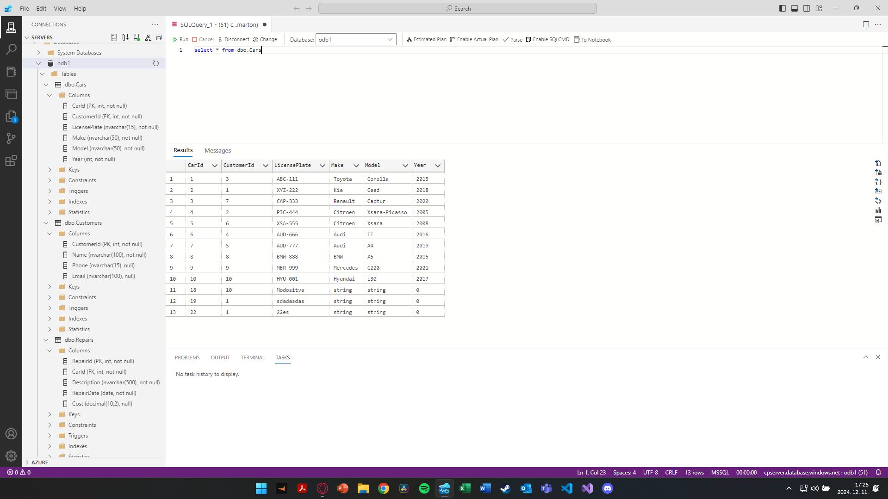
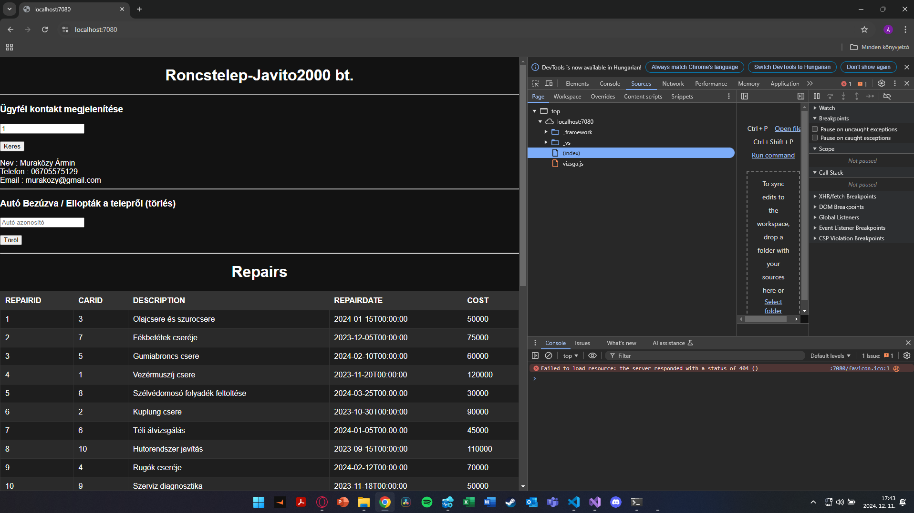
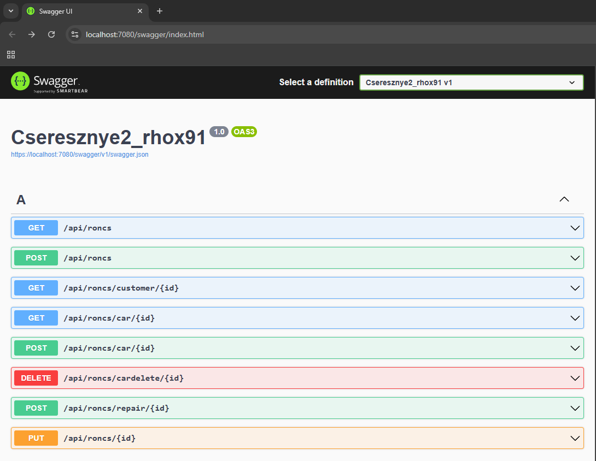
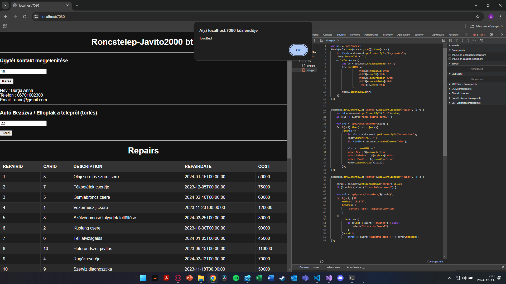
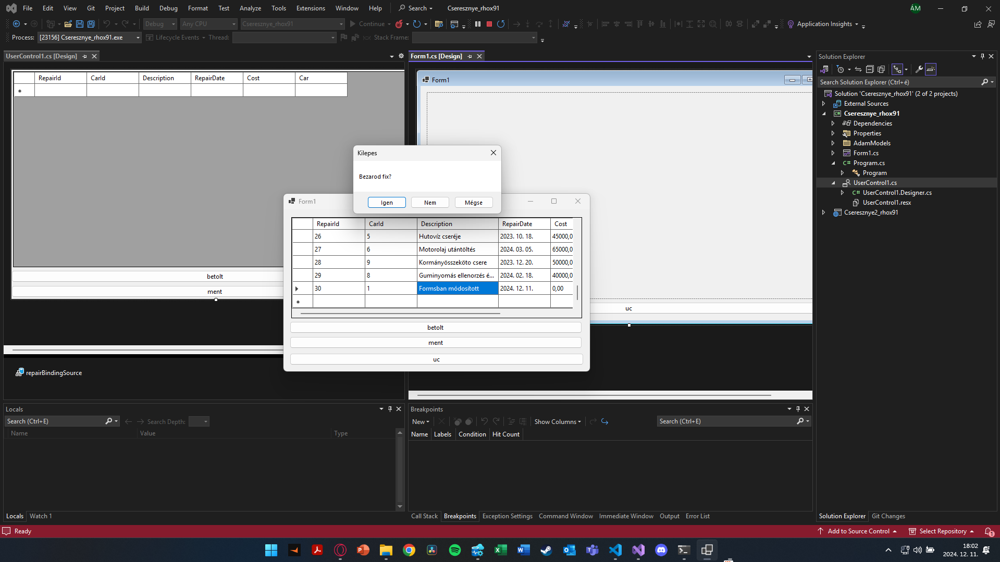

# Pontozólap

**Név:** Marton Ádám  
**Neptun:** RHOX91  

---

## Projekt rövid leírása
Egy egyszerű webapplikáció egy autószerviz által tárolt szervizadatok megjelenítésére. A weboldalon megoldott ezen kívül egyes felhasználók adatainak lekérdezése és autók törlése azonosító alapján. A windows forms appban pedig egy datagridviewban lehet szerkeszteni és menteni a javítások (Repairs) naplóját.

---

## Hozott anyagok

- **3x1p:** Az alkalmazásban használt táblánként pont. 3 tábla van összesen az adatbázisben és mindegyiket használom. (Customers, Cars, Repairs) *(3p)*  
- **1p:** Az adatbázis tartalmaz Constraint-eket (minimum 2). Vannak FORIGN KEY constraintek, továbbá Email formátum (CHECK), illetve egyediségi (UNIQUE) constraint is.  *(1p)*  
- **2p:** Az adatbázis saját Azure SQL szerveren van. `szof2.database.windows.net` -> `odb1` adatbázis, (corvinusos vpn-nel elérhető) *(2p)*  
- **1p:** Az adatbázis adatainak forrásmegjelölése : Az adatbázisom két táblájának rekordjait (Cars, Customers) a részben a baráti köröm adataiból manuálisan írtam meg, a Repairs tábla adatainak generálásájoz a chat gpt-t használtam. A promtban megadtam a meglévő táblák felépítését. *(1p)*  

**Részösszeg:** 7p  

---

## Weboldal

- **1p:** A weboldalnak van egy értelmezhető struktúrája *(1p)*  
- **1p:** A weboldal dinamikus tartalommal tölthető fel adatbázison keresztül *(1p)*  
- **1p:** A weboldal használ legalább 20 sor értelmes CSS-t *(1p)*  

**Részösszeg:** 3p  
**Eddig összesen:** 10p  

---

## Egyéb, extra

- **1p:** Scaffold-DbContext használata *(1p)*  

**Részösszeg:** 1p  
**Eddig összesen:** 11p  

---

## ASP.NET

- **2p:** `program.cs` beállítása a `wwwroot` mappában tárolt statikus tartalmak megosztására *(2p)*  

**Részösszeg:** 2p  
**Eddig összesen:** 13p  

---
###
## API végpontok

- **3p:** Teljes SQL tábla adatainak szolgáltatása API végponton keresztül *(3p)*  
- **2x2p:** SQL tábla egy választható rekordjának szolgáltatása API végponton keresztül *(4p)*  
- **3p:** SQL tábla egy választható rekordjának törlése *(3p)*  
- **5p:** Új rekord felvétele `HttpPost` metóduson keresztül SQL táblába *(5p)*  
- **2x3p:** Rekord módosítása `HttpPost` metóduson keresztül SQL táblában *(6p)*  

**Részösszeg:** 21p  
**Eddig összesen:** 34p  

---

## JavaScript

- **2x5p:** DOM feltöltése JavaScripttel: egy táblába töltő get, egy get by id (ügyfél lekérdezés), és egy törlés fetch *(10p)*  

**Részösszeg:** 10p  
**Eddig összesen:** 44p  

---

# Windows Forms Application

---
## Egyéb, extra

- **1p:** Scaffold-DbContext használata *(1p)*
--- 
## User Interface

- **1x2p** Az alkalmazásból a kilépés csak megerősítő kérdés után lehetséges. *(2p)*
  
- **1x2p** Anchorok alkalmazása: az alkalmazás egészében meg van oldva, hogy az ablak átméretezésekor ki legyen használva a rendelkezésre álló terület. *(2p)*
  
- **1x2p** Olyan alkalmazás elrendezés, melyben gombok lenyomására UserControl-ok kerülnek elhelyezésre egy Panel vezérlőben, teljesen kitöltve azt. Minden gombra jár a pont, amennyiben az funckuonlalitással rendelkező UserControl-t tölt be. (1db) *(2p)*
---  
## Tábla adatainak megjelenítése DataGridView-ban

- **1x2p** Adatok megjelenítése *(2p)*
---
## Adatkötés BindingSource -on keresztül

- **1x2p** Működő BindingSource *(2p)*

**Részösszeg:** 11p  
**Eddig összesen:** 55p  

---

## Összesen: 55p
